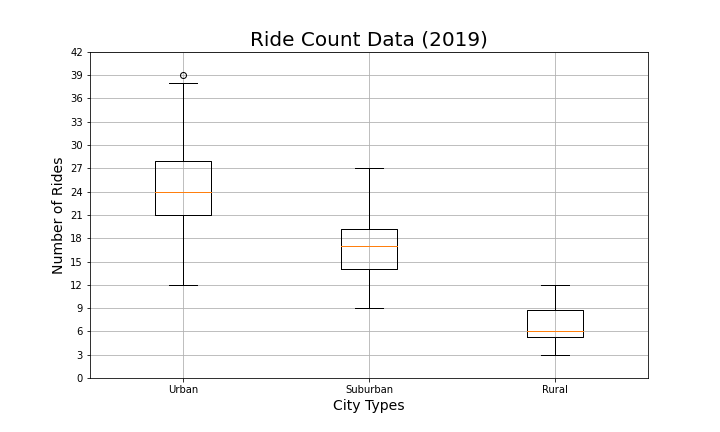
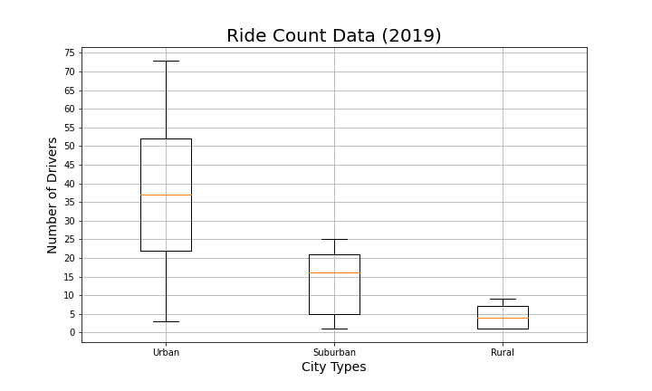
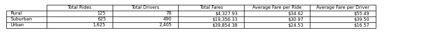

# PyBer Analysis

UTDA Module 4

## Lesson Work

1. Import your data into a Pandas DataFrame.
2. Merge your DataFrames.
3. Create a bubble chart that showcases the average fare versus the total number of rides with bubble size based on the total number of drivers for each city type, including urban, suburban, and rural. 
4. Determine the mean, median, and mode for the following:
   1. The total number of rides for each city type.
   2. The average fares for each city type.
   3. The total number of drivers for each city type.
5. Create box-and-whisker plots that visualize each of the following to determine if there are any outliers:
   1. The number of rides for each city type. 
   2. The fares for each city type. 
   3. The number of drivers for each city type. 
6. Create a pie chart that visualizes each of the following data for each city type:
   1. The percent of total fares. 
   2. The percent of total rides. 
   3. The percent of total drivers. 

## Challenge Work

The purpose of this assignment is to create a table and a line chart to summarize the ride data for Pyber.  The code used for the lesson and the challenge are both found in the "PyBet.ipynb" file in this repository.  First I created a table that shows the total number of rides, total number of Drivers and the total fares by type of ride. The table is below.  The DataFrame is named "PyBerSummaryTableDF" in the code for the challenge.  To create this table I used the dataframes that were created during the lesson and used the GroupBy function to create totals and Counts.  Then I populated a new dataframe with that data and calculated the average fares by adding a new column and calculating the average from the Total Fares and dividing by the number of rides and the number of drivers respectively.  Then I formatted the DataFrame.  There are a couple of conclusions that can be drawn from the table.  First, the Urban fares are more than the total fares of the Rural and Suburban added together, but they have a lower fare per ride.  Another takeaway from the table is the the Urban type is the only type that has more drivers than Total rides.  The line chart below that I created shows how the Total Fares for each week for each City Type.  To create this chart I started with the merged dataframe from the lesson and created a dataframe with a datetime index with just the Fare and City Type data.  Then I created a new dataframe that grouped this data by both Date and City Type and used the pivottable function to create a new dataframe.  Then data data outside of January 2019- April 2019 was dropped from the dataframe and the "resample" function was used to sum up the total fares for each week.  The last step was plotting and formatting the table.  This chart shows that every week the Rural has the lowest total fares, followed by Suburban, with Urban being the largest of the Total fares for every week.  There is some variation for each of the City Types for each week, but the are fairly flat.

The largest challenge that I encountered during the challenge was converting the dataframe to a DateTime Index.  In order to get the data in the proper format with a datetime index I had to create the datetime index and then drop the original date column from the dataframe.  The biggest takeaway that I have from working with these data is to always be mindful of the type of data that is being stored in it and to check the type of data and the index type with the "info" function during each step if you are transforming the data.

When looking at the data my recommendation would be to try to increase the number of rides in the Urban area.  There are currently more drivers than rides used, which means that there are at least 780 drivers that did not give any rides during the time frame analysed, which is not an efficient use of the drivers.  The goal would be to increase revenue from the Urban city type without finding new drivers.  The first additional analysis that would help to gain insight in the area would be a market share analysis.  In order to do this analysis you would need ride data from your competitors.  I would use the same analysis that was used on Pyber data and then combine the summary tables and line charts to see what percentage or rides that each of the companies has in each of the city types.  This would help find areas where demand is higher so you could expand in areas where you are more likely to increase your business.  A second additional analysis that may give additional insight would be looking at the individual city data for the Urban City Types.  For example Creating a scatter plot of number of rides vs the population of the city may give some indication of cities where expansion is possible.  If a city has a large population but a low number of rides, it should stick out on the scatter plot.
